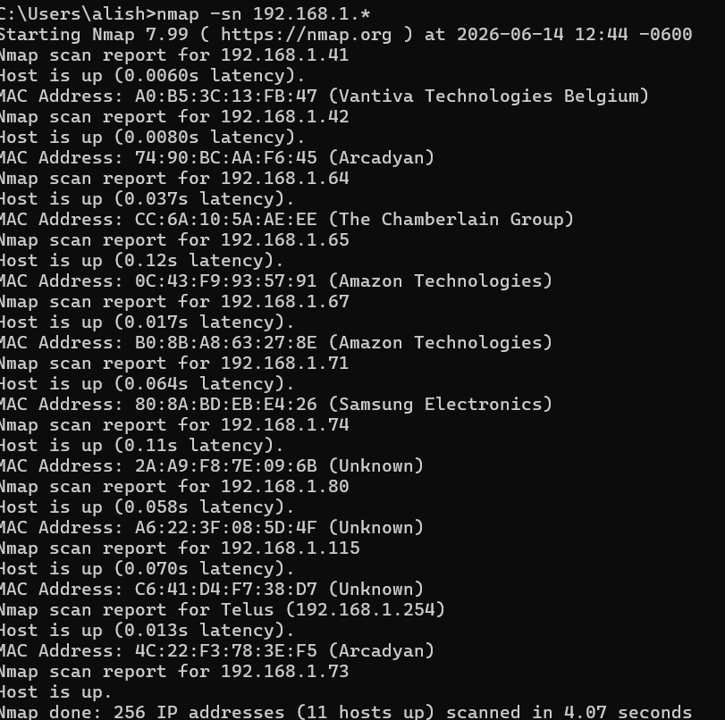

# Nmap Network Discovery
I used Nmap to perform a host discovery scan on my local network using -sn to identify active devices. I mapped all live IPs and created a basic asset inventory. This helped me understand how security analysts maintain visibility of network devices and identify unknown hosts

## Project Overview
This project demonstrates how Nmap can be used to discover active devices on a local network. 
Network discovery is a fundamental task for security analysts because it helps maintain visibility into connected assets and identify unauthorized devices.

## Objective
Identify active hosts on a local network and create a basic asset inventory.

## Command Used
 nmap -sn 192.168.1.*

## What the Command Does
- `nmap` = Runs the Nmap tool
- `-sn` = Performs host discovery only (no port scan)
- `192.168.1.*` = Scans all IP addresses in the subnet

## Skills Demonstrated
- Network Discovery
- Asset Identification
- Basic Reconnaissance
- Security Documentation

## Methodology
1. Determine the local subnet using `ipconfig`.
2. Identify active hosts.
3. Document findings and observations.

## Results
The scan identified active devices on the local network. 

## Security Relevance
Security analysts use host discovery to:
- Maintain an asset inventory
- Identify unknown devices
- Support vulnerability assessments
- Assist with incident investigations

## Key Takeaway
Before assessing security risks, analysts must first understand what devices are present on the network. 
Nmap host discovery provides a quick and effective way to identify active assets.
